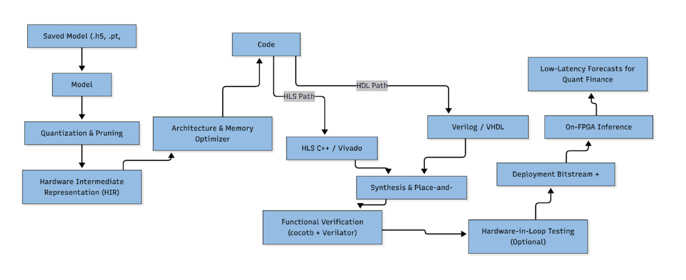

# Project Overview
FPGA-Based Compiler for Quantized Time-Series Model Acceleration and Ultra-Low-Latency Forecasting in Quantitative Finance

## Vision
Build an open-source compiler that automatically converts trained time-series neural networks into optimized, quantized, and verified FPGA implementations. LSTMs are the initial focus, and the design will expand to other sequence models (for example, GRUs and transformer-based variants) over time.

This enables low-latency, high-throughput inference directly on trading or risk management hardware, without manual FPGA design.

## Current Limitations
Tools like hls4ml proved the concept but fall short for production use in finance:

Only supports small MLP/CNN models, with minimal LSTM support.
Limited scalability and poor memory reuse for long time series.
Dependent on vendor HLS tools, creating portability and licensing costs.
No integrated verification or regression testing pipeline.

These constraints make it impractical to deploy complex forecasting models (like LSTMs or GRUs) on an FPGA for production trading or risk systems - despite the clear latency advantages.

## Solution Areas
An end-to-end compiler integrating:

Architecture Optimization
- Pipelined and fused LSTM/GRU cell generation for streaming inference.
- Automated parallelisation and resource balancing for the target FPGA fabric.

Memory Optimization
- On-chip recurrent state reuse and external memory scheduling
- Mixed-precision quantization tuned to financial model accuracy tolerances

Automated Verification
- HDL testbenches and cocotb regression tests generated automatically.
- Cycle-accurate validation against the original model predictions.

Open HDL Backend
- Vendor-independent HDL output, compatible with both commercial (Xilinx/Intel) and open toolchains (yosys/nextpnr).

## IR Graph And Operator Registry
The IR graph is now built from two core objects:

- `Value`: typed tensors, scalars, and state values that carry shape, axes, dtype, and quantization metadata.
- `Operator`: an abstract IR node with stable serialized fields (`op_id`, `op_type`, `inputs`, `outputs`, `attrs`, `name`, `source_span`).

`Graph` stores `Value` objects and concrete `Operator` instances. Operators are created through an explicit runtime `OperatorRegistry`, which is the extension point for both built-in and custom operators.

The default registry is preloaded with the current primitive operator library:

- Linear/tensor ops: `MatMul`, `Add`, `Sub`, `Mul`, `Div`, `Transpose`, `Reshape`, `Concat`, `Slice`
- Nonlinearities: `Sigmoid`, `Tanh`, `ReLU`, `GELU`, `Softmax`
- Reductions and normalization: `Sum`, `Mean`, `Max`, `LayerNorm`
- Temporal ops: `Conv1D`, `Pad`, `Shift`

Model-level operators such as `LSTM`, `GRU`, or `Transformer` are intentionally not part of the IR. Those models should be lowered into graphs of primitive operators.

## Registry Usage
```python
from src.ir_graph.graph import Graph
from src.ir_graph.registry import default_registry

graph = Graph(
    values=values,
    ops={},
    graph_inputs=["x"],
    graph_outputs=["y"],
    registry=default_registry,
)

graph.create_operator(
    "Add",
    op_id="add_0",
    inputs=["lhs", "rhs"],
    outputs=["sum_out"],
)
```

## Custom Operators
Custom operators are regular Python subclasses of `Operator` that are registered explicitly at runtime.

```python
from src.ir_graph.op import FPGACost, Operator
from src.ir_graph.registry import OperatorRegistry


class CustomScale(Operator):
    OP_TYPE = "CustomScale"

    def validate(self, values):
        ...

    def estimate_fpga_cost(self, values):
        return FPGACost(latency_cycles=4, dsp=1, lut=4, ff=4)

    def hls_template_path(self):
        return "templates/custom_scale.cpp.tpl"

    def hls_context(self, values):
        return {"op_id": self.op_id, "scale": self.attrs["scale"]}


registry = OperatorRegistry()
registry.register(CustomScale)
```

Every operator defines:

- `validate(values)`: structural and shape-aware validation against the graph value environment
- `estimate_fpga_cost(values)`: coarse FPGA cost estimate used for scheduling and design-tradeoff analysis
- `hls_template_path()`: the HLS template file for the operator
- `hls_context(values)`: the template variables used to render that file

## HLS Templates
Built-in operators use repo-managed templates under `hls/operators/*.cpp.tpl`. The helper `render_operator_hls(...)` validates the operator, resolves its template, and renders it with `string.Template`.

Relative template paths are resolved in this order:

1. Relative to the project root
2. Relative to the operator subclass module

That means third-party or user-defined operator packages can ship their own HLS templates next to the Python module that defines the operator.

```python
from src.ir_graph.hls import render_operator_hls

hls_source = render_operator_hls(operator, values)
```

Template resolution and rendering fail fast with explicit errors when files are missing or required template variables are not provided.

## Overview Diagram


## Timeline
Simple 3-Month Overview

Month 1 - Setup and Model Conversion (5-10 tickets)
- Define project scope and core architecture.
- Establish the intermediate representation and operator registry.
- Build initial model parsers (ONNX first, then PyTorch and TensorFlow).
- Create quantization configuration and data calibration flow.
- Implement early model validation and baseline HLS template system.

Month 2 - Hardware Implementation and Optimization (5-10 tickets)
- Implement the HLS generator and simulator pipeline.
- Add custom operators and expand IR coverage.
- Build hardware optimizations (memory scheduling, operation fusion).
- Introduce a latency cost model for design tradeoffs.
- Create the bitstream build wrapper and runtime inference interface.

Month 3 - Deployment and Validation (5-10 tickets)
- Package the toolchain as a Python package with a CLI.
- Run latency benchmarks and validate end-to-end performance.
- Harden documentation, tutorials, and contribution guidelines.
- Finalize deployment flow and PoC deliverables.
- Deliver a PoC suitable for presentation to a supervisor for the AMD competition.
